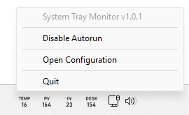

# System Tray Monitor

A Windows system tray application that displays real-time values from a JSON API as system tray icons. Each icon shows a label and a value that updates periodically.



## Features

- Multiple system tray icons with labels and values
- Configurable polling interval for API updates
- Right-click menu with:
  - Version information
  - Autorun toggle (start with Windows)
  - Configuration file editor
  - Quit option
- Automatic restart on configuration changes
- Customizable font settings
- Environment-based configuration
- Automatic error handling and recovery
- File-based logging for debugging

## Requirements

- Windows 10 or later
- Python 3.7 or later
- Required Python packages (see Installation)

## Installation

1. Clone this repository:
```bash
git clone https://github.com/slauber/systray.git
cd systray
```

2. Install required Python packages:
```bash
pip install -r requirements.txt
```

3. Create a `.env` file in the project directory with your configuration (see Configuration section).

## Configuration

Create a `.env` file in the project directory with the following settings:

```env
# API Configuration
API_URL=your_api_url_here
API_HEADERS_ACCEPT=application/json
POLL_INTERVAL=30

# Font Configuration
FONT_PATH=C:\Windows\Fonts\bahnschrift.ttf
LABEL_FONT_SIZE=13
VALUE_FONT_SIZE=17

# Icon Configuration
ICON_PV=pvPower
ICON_DESK=deskPower
ICON_TEMP=temp
```

### Configuration Options

- `API_URL`: The URL of your JSON API endpoint
- `API_HEADERS_ACCEPT`: The Accept header for API requests (default: application/json)
- `POLL_INTERVAL`: How often to update values in seconds (default: 30)
- `FONT_PATH`: Path to the TrueType font file to use
- `LABEL_FONT_SIZE`: Font size for icon labels (default: 13)
- `VALUE_FONT_SIZE`: Font size for icon values (default: 17)
- `ICON_*`: Define icons to display. The key format is `ICON_LABEL` where LABEL is what appears above the value. The value is the JSON path to get the value from the API response.

## Usage

1. Start the application:
```bash
# Normal start (console logging)
python systray.py

# Start with file logging
python systray.py --log-to-file
```

2. The application will create system tray icons for each configured value.

3. Each icon shows:
   - Label (top)
   - Current value (bottom)
   - Updates automatically based on POLL_INTERVAL

4. Right-click any icon to:
   - View version information
   - Enable/Disable autorun (start with Windows)
   - Open configuration file for editing
   - Quit the application

### Autorun Feature

The application can be configured to start automatically with Windows:
1. Right-click any system tray icon
2. Click "Enable Autorun" to make the app start with Windows
3. Click "Disable Autorun" to remove it from startup

The autorun feature:
- Creates a Windows shortcut in the startup folder
- Uses a background batch file to ensure proper working directory
- Runs without showing any command windows
- Automatically logs to files in the `logs` directory

### Configuration Changes

The application automatically detects changes to the `.env` file:
1. Right-click any system tray icon
2. Click "Open Configuration" to edit the `.env` file
3. Save your changes
4. The application will automatically restart with the new configuration

### Logging

The application supports two logging modes:
1. **Console Logging** (default):
   - Shows logs in the console window
   - Useful for development and debugging

2. **File Logging** (with `--log-to-file`):
   - Creates timestamped log files in the `logs` directory
   - Useful for troubleshooting autorun issues
   - Log files are named `systray_YYYYMMDD_HHMMSS.log`

## Troubleshooting

### Common Issues

1. **Icons not appearing**
   - Check if the API URL is correct
   - Verify the JSON paths in your ICON_* settings
   - Check the application logs for errors

2. **Font issues**
   - Ensure the font path is correct
   - Try using a different system font
   - Check if the font file exists

3. **API connection issues**
   - Verify your API URL
   - Check your network connection
   - Ensure the API is accessible

### Logging

The application logs to either the console or files with timestamps. Check the logs for detailed error messages and debugging information.

## Development

### Project Structure

- `systray.py`: Main application code
- `.env`: Configuration file
- `requirements.txt`: Python package dependencies
- `logs/`: Directory containing log files (when using file logging)

### Adding New Icons

To add a new icon:

1. Add a new entry to your `.env` file:
```env
ICON_NEWLABEL=json.path.to.value
```

2. The application will automatically detect the change and restart with the new icon

### Building from Source

No build step is required. The application runs directly from the Python source.

## License

Copyright 2025 - Sebastian Lauber

Permission is hereby granted, free of charge, to any person obtaining a copy of this software and associated documentation files (the “Software”), to deal in the Software without restriction, including without limitation the rights to use, copy, modify, merge, publish, distribute, sublicense, and/or sell copies of the Software, and to permit persons to whom the Software is furnished to do so, subject to the following conditions:

The above copyright notice and this permission notice shall be included in all copies or substantial portions of the Software.

THE SOFTWARE IS PROVIDED “AS IS”, WITHOUT WARRANTY OF ANY KIND, EXPRESS OR IMPLIED, INCLUDING BUT NOT LIMITED TO THE WARRANTIES OF MERCHANTABILITY, FITNESS FOR A PARTICULAR PURPOSE AND NONINFRINGEMENT. IN NO EVENT SHALL THE AUTHORS OR COPYRIGHT HOLDERS BE LIABLE FOR ANY CLAIM, DAMAGES OR OTHER LIABILITY, WHETHER IN AN ACTION OF CONTRACT, TORT OR OTHERWISE, ARISING FROM, OUT OF OR IN CONNECTION WITH THE SOFTWARE OR THE USE OR OTHER DEALINGS IN THE SOFTWARE.

## Contributing

1. Fork the repository
2. Create your feature branch
3. Commit your changes
4. Push to the branch
5. Create a new Pull Request 